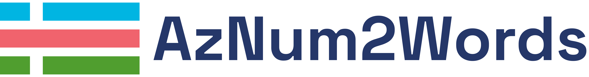

<!---


-->


- - -

[](https://goreportcard.com/report/github.com/egasimov/aznum2words)

[](https://github.com/egasimov/aznum2words/stargazers)
[](https://codecov.io/gh/egasimov/aznum2words)

[](./LICENSE)
[](https://godoc.org/github.com/egasimov/aznum2words)

[//]: # ([![Github Last Commit]&#40;https://img.shields.io/github/last-commit/egasimov/aznum2words?color=61dfc6&label=last%20commit&#41;]&#40;&#41;)
[//]: # (![GitHub all releases]&#40;https://img.shields.io/github/downloads/egasimov/aznum2words/total&#41;)


**AzNum2Words** - Azərbaycan dilində ədədlərin sözlə yazılışı(və ya təsviri) üçün nəzərdə tutulan Go 
dilində yazılmış, açıq qaynaqlı kitabxanadır.

- - -

## Məqsəd | Goal
Azərbaycan dilində ədədlərin(və ya rəqəmlərin) sözlə yazılış təsvirinə ehtiyac yarandığı hallar olur. Proqram səviyyəsində bu kimi ehtiyacları qarşılamaq üçün vahid bir kitabxananın olması, proqramçıların işini xeyli asanlaşdırır.
Kitabxana tam və ya kəsr ədədlərin Azərbaycan dilində sözlə yazılışı(və ya təsviri) üçün nəzərdə tutulub.

- - -

## İstifadə formaları | Usage forms

Həm [library](#kitabxana-kimi-istifadə-qaydası--guideline-for-using-as-library), həm
də [command-line tool](#cli-kimi-istifadə-qaydası--guideline-for-using-as-cli-app) kimi istifadə edilə bilər.

Bu kitabxana vasitəsilə - müsbət, mənfi tam və ya kəsr ədədlərin sözlə yazılış təsvirini əldə etmək mümkündür.

- - -

## İstifadə yerləri | Use cases

Azərbaycan dilində ədədlərin təsvirinə ehtiyac duyulan hallarda istifadə oluna bilər.

* Statistik hesabatların tərtib olunması.
* Maliyyə əməliyyatları zamanı məbləğin sözlə təsvir olunması.
* Hüquqi və maliyyə sənədləri tez-tez çaşqınlığın qarşısını almaq və dəqiqliyi təmin etmək
  üçün rəqəmlərin ifadə sözünün istifadəsini tələb edir.
* Çek yazarkən, dəyişikliklərin və ya saxtakarlığın qarşısını almaq üçün rəqəmsal məbləğə əlavə olaraq məbləğin sözlə
  ifadəsini də yazmaq adi bir təcrübədir.

- - -

## Özəlliklər | Features

* Tam ədədlərin sözlə təsvir olunması
* Kəsr ədədlərin sözlə təsvir olunması
* Müsbət vəya mənfi ədədlərin sözlə təsvir olunması
* Söz ilə təsvir oluna biləcək maksimum tam ədəd: 10^63
* Söz ilə təsvir oluna biləcək minumum kəsr ədəd: (10^-15)

- - -

## Kitabxananın proyektə əlavə edilməsi | Add library into the project

```shell
go get github.com/egasimov/aznum2words@latest
```

## Kitabxana kimi istifadə qaydası | Guideline for using as library

```go
package main

import (
	"fmt"
	"github.com/egasimov/aznum2words"
)

func main() {
	// in real use, do not discard errors, rather handle it properly :)
	result1, _ := aznum2words.SpellNumber("-95412")
	result2, _ := aznum2words.SpellNumber("-2.7021")
	result3, _ := aznum2words.SpellNumber("5611113210")

	fmt.Println(result1)
	fmt.Println(result2)
	fmt.Println(result3)
}

```

<br/>**NƏTİCƏ | OUTPUT**

```text
mənfi doxsan beş min dörd yüz on iki
mənfi iki tam on mində yeddi min iyirmi bir
beş milyard altı yüz on bir milyon bir yüz on üç min iki yüz on
```

- - -

## CLI kimi quraşdırılması | CLI-Installation

```shell
// installs the binaries into $GOPATH/bin
go install github.com/egasimov/aznum2words/cmd/aznum2words-cli@latest
```

## CLI kimi istifadə qaydası | Guideline for using as CLI app

```shell
$ aznum2words-cli -- 12.3
on iki tam onda üç

$ aznum2words-cli -- -12.3
mənfi on iki tam onda üç

```

- - -

## Test caseləri yoxlanması | Check test cases

```shell
go test ./...
```

## Benchmark yoxlanılması

```shell
go test -bench=. -run=^# -benchmem
```


- - -

## Versiyalar | Releases

Kitabxananın versiyaları [Semver](http://semver.org/) yanaşması ilə tənzimlənir.

- - -

## Lisenziya | License

Kitabxana MIT Lisenziya altında lisenziyalaşdırılmışdır. Ətraflı məlumat üçün
[LICENSE](./LICENSE) faylını nəzərdən keçirin.


- - -

## Proyektə necə dəstək olmaq olar | How to contribute to project ?

Proyektə contribute etmək üçün aşağıdakı təlimatları nəzərə ala bilərsiniz.

*Testləri olmayan vəya nəzərə alınmayan PRlar qəbul edilməyəcək*

1. Reponu fork et
2. Yeni feature branch yarat (`git checkout -b my-new-feature`)
3. Dəyişiklikləri commit et (`git commit -am 'Added some feature'`)
4. Local branchı origin(remote repo) push et  (`git push origin my-new-feature`)
5. Yeni Pull Request yarat

- - - 

## Contributorlar

Bu layihəyə aşağıdakı şəxslər töhfə verib:

<!-- Contributors list -->
<a href="https://github.com/egasimov/aznum2words/graphs/contributors">
  
</a>

<!--Made with [contrib.rocks](https://contrib.rocks). -->
<!-- Contributors list -->
